### Ejercicio 1#:

Valor de transicion:
- Por lados 10
- En diagnoral 14

| 1 H=110 G=50 F=160   | ==H=100 G=54 F=154== | ==H=90 G=64 F=154== | ==H=80 G=80 F=160== | ==H=70 G=90 F=150== | H=60 G=100 F=160 |         |
| ----------------------------------- | -------------------------- | ------------------------- | ------------------------- | ------------------------- | ---------------------- | ------- |
| ==8 H=100 G=40 F=140==     | **x**                      | **x**                     | **x**                     | H=60 G=100 F=160    | H=50 G=104 F=154 |         |
| ==15 H=90 G=30 F=120==     | H=80 G=34 F=114      | H=70 G=38 F=108     | **x**                     |                           | **x**                  |         |
| ==22 H=80 G=20 F=100==     | H=70 G=24 F=94       | H=60 G=28 F=88      | **x**                     |                           |                        |         |
| ==29 H=70 G=10 F=80==      | H=60 G=14 F=74       | **x**                     | **x**                     | **x**                     | **x**                  |         |
| ==36==  ==START==                | H=50 G=10 F=60       | H=40 G=20 F=60      | H=30 G=30 F=60      | H=20 G=30 F=50      | **x**                  | ==END== |
### Ejercicio 2# A*:

![[IMG_20250902_102021.jpg]]

Ejercicio resuelto:

![[1756831673842.jpg]]

### Ejercicio 3#: Caballo

| x0  |     |     |     |     |     |     |     |
| --- | --- | --- | --- | --- | --- | --- | --- |
|     |     |     |     |     |     |     |     |
|     |     | x   | x   | x   | x   |     |     |
|     |     | x   |     |     | x   |     |     |
|     |     | x   |     |     | x   |     |     |
|     |     | x   | x   | x   | x   |     |     |
|     |     |     |     |     |     |     |     |
|     |     |     |     |     |     |     |     |

### Ejercicio 4#: Cuadro magico

15 por los lados (1-9)

| 8   | 1   | 6   |
| --- | --- | --- |
| 3   | 5   | 7   |
| 4   | 9   | 2   |
### Ejercicio 5#: Canicas (Damas chinas)

```mermaid
stateDiagram-v2
    [*] --> Inicio

    state "Inicio\nVacío=13" as Inicio
    state "Paso 1\n(15,14,13)" as P1
    state "Paso 2\n(12,13,14)" as P2
    state "Paso 3\n(6,9,13)" as P3
    state "Paso 4\n(11,8,6)" as P4
    state "Paso 5\n(3,5,8)" as P5
    state "Paso 6\n(7,8,9)" as P6
    state "Paso 7\n(10,9,8)" as P7
    state "Paso 8\n(2,4,7)" as P8
    state "Paso 9\n(14,13,12)" as P9
    state "Paso 10\n(12,8,5)" as P10
    state "Paso 11\n(6,5,4)" as P11
    state "Paso 12\n(7,4,2)" as P12
    state "Paso 13\n(1,2,4)" as P13

    Inicio --> P1
    P1 --> P2
    P2 --> P3
    P3 --> P4
    P4 --> P5
    P5 --> P6
    P6 --> P7
    P7 --> P8
    P8 --> P9
    P9 --> P10
    P10 --> P11
    P11 --> P12
    P12 --> P13
    P13 --> [*]


```

Python
Sklearn
OpenCv
Keras

